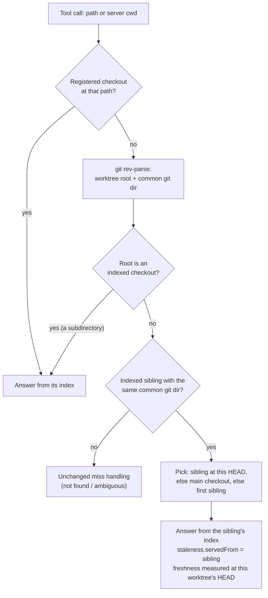

<div align="center">

<picture>
  <source media="(prefers-color-scheme: dark)" srcset="docs/fork/brand/lobi-horizontal-reversed.svg">
  
</picture>

### GitNexus code intelligence for every git worktree

AI coding agents run in parallel, each in its own `git worktree`.<br>
**lobi-GitNexus** gives every one of them the same code knowledge graph, and tells them exactly how fresh it is.

<p>
  <a href="#why-this-fork"></a>
  <a href="https://github.com/abhigyanpatwari/GitNexus"></a>
  <a href="https://modelcontextprotocol.io/"></a>
  <a href="LICENSE"></a>
</p>

<a href="#why-this-fork">Why this fork</a> ·
<a href="#before-and-after">Before and after</a> ·
<a href="#quick-start">Quick start</a> ·
<a href="#how-it-works">How it works</a> ·
<a href="docs/fork/gitnexus-reference.md">Full reference</a>

</div>

---

## Why this fork

[GitNexus](https://github.com/abhigyanpatwari/GitNexus) indexes a codebase into a knowledge graph (every call chain, dependency, cluster and execution flow) and serves it to AI agents through MCP tools such as `impact`, `context`, `query` and `detect_changes`.

Today, agents rarely work in one checkout. Claude Code, Codex and Cursor sessions each get their own `git worktree`, and a new worktree has no index until someone runs `gitnexus analyze` in it. In upstream GitNexus 1.6.12, an agent in a new worktree gets one of three results:

- **A wrong "current".** With one indexed repo, the agent gets the main checkout's graph, and `staleness.status` says `current`. That status is measured against the *main checkout's* HEAD, not the worktree the agent is editing.
- **An error.** With several indexed repos, the call fails with `Multiple repositories indexed`.
- **"Not found".** Passing the worktree path, or any subdirectory of an indexed checkout, as `repo` fails with `Repository "<path>" not found`.

This fork fixes all three. The graph tools (`query`, `context`, `impact`, `cypher`) and `detect_changes` answer from a sibling worktree's index, and they **say so**: the response names the sibling it came from and measures freshness against *your* worktree's HEAD.

## Before and after

| Agent works in… | Upstream GitNexus 1.6.12 | lobi-GitNexus |
|---|---|---|
| A new worktree, one repo indexed | Main checkout's graph, reported as `current` | Same graph, with `staleness.servedFrom` set and `status` measured at the worktree HEAD (for example `behind`, 1 commit) |
| A new worktree, several repos indexed | `Multiple repositories indexed` | The sibling worktree of the *same* repository answers |
| `repo: "<absolute worktree path>"` | `Repository "<path>" not found` | The sibling worktree answers, marked `servedFrom` |
| `repo: "<absolute subdirectory of an indexed checkout>"` | `Repository "<path>" not found` | Resolves to that checkout |
| Several indexed siblings | — | Prefers the sibling indexed at the worktree's own HEAD, then the main checkout |
| `detect_changes` for a worktree | Diffs only when the server was *launched* in it | Also diffs the worktree you name with `repo` |
| `rename`, `read_file`, `grep` | Exact checkout only | **Unchanged.** Writes and file reads never use a sibling's checkout |
| `GITNEXUS_MCP_ALLOWED_REPOS` set | Exact allowed checkouts | **Unchanged.** No fallback, so the allowlist cannot widen |
| An unrelated repository, or another submodule of the same superproject | — | **Unchanged.** No fallback across repositories |

The difference that matters is the last column's honesty. An agent can trust an answer it is told is approximate. It cannot trust an answer that is wrong and labelled `current`.

## See it

`gitnexus impact` run against a fresh worktree that is one commit ahead of the indexed main checkout. This is real output from this repository (61,654 symbols), with paths and the branch name generalised. The first call returned in about 3 seconds, with no `analyze` in the worktree:

```jsonc
"staleness": {
  "status": "behind",                      // measured at the worktree's HEAD, not main's
  "branch": "main",
  "lastCommit": "ff922c0a3b0cfc997dfd5b0d35f0c60955f1dc6c",
  "measuredAgainst": "HEAD",
  "commitsBehind": 1,
  "servedFrom": "~/code/my-app",           // the sibling whose index answered
  "hint": "⚠️ Index is 1 commit behind HEAD. Run analyze tool to update. This worktree has no index of its own; answered from sibling worktree ~/code/my-app. Run `gitnexus analyze --index-only` in this worktree for an exact graph."
}
```

Upstream GitNexus returns `Repository "<path>" not found` for the same call.

## Quick start

The npm package `gitnexus` is upstream GitNexus. To get this fork, build it from source:

```bash
git clone https://github.com/philong-buile/lobi-GitNexus.git
cd lobi-GitNexus/gitnexus
npm install && npm run build
npm link            # puts this build's `gitnexus` on your PATH
```

Then use it like GitNexus:

```bash
cd /path/to/your/repo
gitnexus analyze    # index the main checkout once
gitnexus setup      # write the MCP config for Claude Code, Cursor, Codex, …
```

Create worktrees as usual (`git worktree add ../feature-x`). Agents in them get answers right away. When a worktree drifts far from its sibling, index it for an exact graph:

```bash
cd ../feature-x && gitnexus analyze --index-only
```

To go back to upstream: `npm unlink -g gitnexus && npm install -g gitnexus`.

## How it works



- **Graph tools only.** `query`, `context`, `impact`, `cypher` and `detect_changes` may fall back, and each marks its answer with `staleness.servedFrom`. `read_file` and `grep` would read the sibling's files, and `rename` must edit the checkout you asked for, so none of them falls back.
- **Same repository only.** Siblings are matched by `git rev-parse --git-common-dir` itself, never by name or by its parent folder, so an unrelated repo, or another submodule of the same superproject, cannot answer.
- **Allowlists stay exact.** With `GITNEXUS_MCP_ALLOWED_REPOS` set, the fallback is off.
- **Honest staleness.** The cached freshness check is keyed per worktree, and the `hint` says which sibling answered and how to get an exact graph.
- **No change when nothing falls back.** Calls that resolve to a checkout's own index return exactly what upstream returns.

The change lives in [`gitnexus/src/mcp/local/local-backend.ts`](gitnexus/src/mcp/local/local-backend.ts) (`worktreeFallback`) and [`gitnexus/src/core/staleness-status.ts`](gitnexus/src/core/staleness-status.ts) (`servedFrom`).

## Verified

- [`worktree-repo-fallback.test.ts`](gitnexus/test/unit/worktree-repo-fallback.test.ts) builds real git repositories with linked worktrees. It covers:
  - an explicit worktree path
  - a subdirectory
  - one repo and several repos selected by cwd
  - preferring the sibling indexed at the worktree's HEAD
  - `rename`, `read_file` and an explicit opt-out never falling back
  - no fallback across repositories, or between two submodules of one superproject
  - `detect_changes` diffing the asked-about worktree, even when the sibling that answers is itself a linked worktree
  - the `servedFrom` payload

  The real staleness check runs; only the registry and database are stubbed.
- The existing MCP, staleness, repository-policy and `detect_changes` suites pass.
- Smoke test with the real CLI against a fresh worktree:
  - `impact` returns the response shown above.
  - `detect-changes --repo <worktree>` diffs that worktree, even when started from another directory.

```bash
cd gitnexus
npx vitest run test/unit/worktree-repo-fallback.test.ts
npx tsc --noEmit
```

## Everything else is GitNexus

Apart from worktree handling, this fork is GitNexus 1.6.12:

- 19 MCP tools: `impact`, `context`, `query`, `detect_changes`, `rename`, `cypher`, `trace`, `route_map`, `shape_check` and more.
- Precomputed clusters, execution flows and confidence-scored call chains, so one tool call returns complete context.
- Agent skills, Claude Code hooks, `gitnexus setup` for every major editor, wiki generation, and a web UI.

The complete upstream guide (installation problems, CLI reference, editor setup, Docker, embeddings, tool examples) is in **[docs/fork/gitnexus-reference.md](docs/fork/gitnexus-reference.md)**.

## Staying in sync with upstream

```bash
git remote add upstream https://github.com/abhigyanpatwari/GitNexus.git
git fetch upstream && git merge upstream/main
```

## Credits and license

lobi-GitNexus is a fork of [GitNexus](https://github.com/abhigyanpatwari/GitNexus) by Abhigyan Patwari. All credit for the engine belongs to the GitNexus authors and contributors. This fork adds worktree-aware repository resolution and its own [identity](docs/fork/brand/README.md); it is not affiliated with or endorsed by upstream.

Licensed under the [PolyForm Noncommercial License 1.0.0](LICENSE), the same as upstream.

Required Notice: Copyright Abhigyan Patwari (https://github.com/abhigyanpatwari/GitNexus)
